# ergasia_gem5_arxitektoniki_Vasileios_Kalantzis
Το repository με την εργασία gem5 για το μάθημα αρχιτεκτονικής υπολογιστών

# Αναφορά Project: Gem5 Simulation

## Πρώτο Μέρος

### 1.
Σύμφωνα με το strarter_se.py τα βασικά χαρακτηριστικά του συστήματος είναι MinorCPU (αυτό το επιλέξαμε εμείς) ως τύπος CPU, η συχνότητα λειτουργίας είναι 1GHz, έχουμε έναν πυρήνα, L1 cache, walker cache και L2 cache που έχουν 64 cache_line_size, 2 μνήμες DDR3_1600_8x8 με μέγεθος 2GB

### 2.

**Α.** Αυτά τα καταλαβαίνουμε από το starter_se.py. Για να επιβεβαιώσουμε τα χαρακτηριστικά του συστήματος και να δούμε επιλογές που μπορεί να μην φαίνονται χρησιμοποιούμε το config.ini και βλέπουμε τιμές για dcache, icache, L2 cache και walker cache
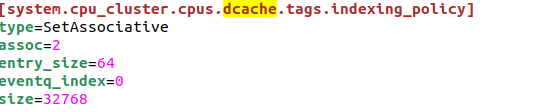
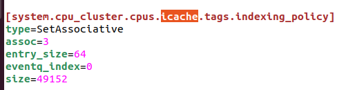
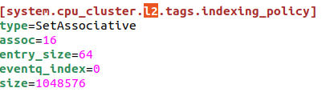
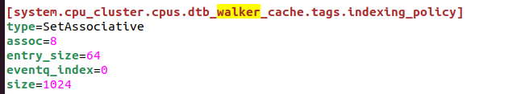

Όπου το assoc είναι το associativity, το entry_size είναι το cache_line και το size αντιστοιχεί στο μέγεθος

**DDR3**  
[system.mem_ctrls0]  
tCK=1250 η συχνότητα σε ns  
device_size=536870912 δηλαδή 512ΜΒ  
devices_per_rank=8 και ranks_per_channel=2  
άρα η κάθε ram είναι 512*8*2=8GB  
αλλά έχουμε 2 DDR ίδιου μεγέθους άρα συνολικά έχουμε 16GB

**Β.** Sim_seconds: είναι ο χρόνος που τρέχει το πρόγραμμα στο hardware που εξομοιώνουμε δηλαδή στον arm επεξεργαστή με minorCPU.  
Sim_ticks: Τα ticks είναι η μονάδα χρονικής μέτρησης στο Gem5 που χρησιμοποιείτε για να εξάγουμε και τα sim seconds 1tick=1/clk_frequency. Το sim σημαίνει ότι είναι μόνο για την προσομοίωση.  
Sim_insts: είναι ο αριθμός των εντολών που εκτελούνται μόνο στο προσομοιωμένο σύστημα  
Host_inst_rate: Ο ρυθμός που εκτελούνται εντολές στον υπολογιστή που τρέχει την προσομοίωση (εντολή/s)

**Γ.** Κοιτώντας τα committed instructions και τα instructions δεν είδα διαφορά στα νούμερα. Λογικά αν υπήρχε διαφορά θα ήταν εξαιτίας πραγμάτων όπως out of order execution και branch misprediction. Το νούμερο αλλάζει ανάλογα με το μοντέλο του επεξεργαστή που θα χρησιμοποιήσουμε

**Δ.** Οι τιμές των προσπελάσεων dcache και l2 είναι:  
system.cpu_cluster.cpus.dcache.overall_accesses::total         2160  
system.cpu_cluster.l2.overall_accesses::total          474

### 3.

**Α. Timing Simple CPU:** είναι ένα απλό μοντέλο CPU που χρησιμοποιείτε κυρίως για testing. Ο τρόπος λειτουργίας του είναι ο εξής: Στέλνει εντολή fetch(), translateTiming(), sendFetch() και sendTiming() για κάθε εντολή του προγράμματος και περιμένει μέχρι να έρθει ελέγχοντας με την recvTiming(). Δεν έχει pipeline όπως ο MinorCPU. Κάθε αριθμητική εντολή τελειώνει σε έναν κύκλο ενώ οι προσπελάσεις μνήμης απαιτούν πολλούς κύκλους.

**MinorCPU:** Είναι ένας πιο περίπλοκος επεξεργαστής με την πιο σημαντική διαφορά να είναι τα 4 pipeline stages. Το πρώτα 2 είναι fetch, το πρώτο fetch παίρνει τις πληροφορίες από την μνήμη. Το δεύτερο βάζει τις εντολές σε ένα buffer και τις χωρίζει σε ξεχωριστές εντολές οι οποίες μπαίνουν σε ένα διάνυσμα και πάνε στο επόμενο στάδιο. Στο διάνυσμα αυτό προστίθεται και το αποτέλεσμα του branch predictor ενώ ταυτόχρονα ενημερώνεται και το πρώτο fetch. Έπειτα στο στάδιο decoding το διάνυσμα επεξεργάζεται ώστε να μπορούν να εκτελεστούν οι εντολές στο επόμενο στάδιο. Τέλος στο execute εκτελούνται οι εντολές. Μέσω του gem5 μπορούμε να αλλάξουμε παραμέτρους για τα διανύσματα που περιέχουν τις εντολές, δηλαδή να ελέγξουμε πόσες εντολές περνάνε σε κάθε στάδιο.

**Β.** Κοιτώντας τα αποτελέσματα για τους 2 επεξεργαστές παρατηρούμε διαφορές που επιβεβαιώνουν τα χαρακτηριστικά των επεξεργαστών. Αρχικά ο χρόνος host_seconds είναι τριπλάσιος στην minorCPU ενώ το sim_seconds είναι μικρότερο το οποίο μας δείχνει ότι η minorCPU είναι πιο περίπλοκη, αφού το σύστημα παίρνει πιο πολύ χρόνο για να τον εξομοιώσει αλλά το simulated πρόγραμμα τρέχει πιο γρήγορα εξαιτίας του pipeline.  
- Αλλαγή σε system clock και CPU clock σε 2GHz: μειώθηκαν οι χρόνοι εκτέλεσης και των 2 επεξεργαστών. Συγκεκριμένα μειώθηκε το CPI στην minorCPU και μειώθηκαν οι κύκλοι προσομοίωσης στην TimingSimpleCPU.  
- Αλλαγή σε DDR4_2400_16x4: Μικρή βελτίωση στην minorCPU. Ενώ το bandwidth έχει αυξηθεί και το latency της μνήμης έχουν πέσει, το πρόγραμμα είναι πολύ απλό οπότε δεν προκαλεί σημαντική διαφορά. Ομοίως στην TimingSimpleCPU.

---

## Μέρος 2

### Βήμα 1

1. Η default τιμές είναι:  
Icache: associativity=2, Size=32KB  
Dcache: associativity=2, Size=64KB  
L2: associativity=8, Size=2ΜΒ  
To cache_line είναι 64  
Η κύρια μνήμη είναι DDR3_1600_8x8 με χωρητικότητα 512MBx8x2=8GB

2.
  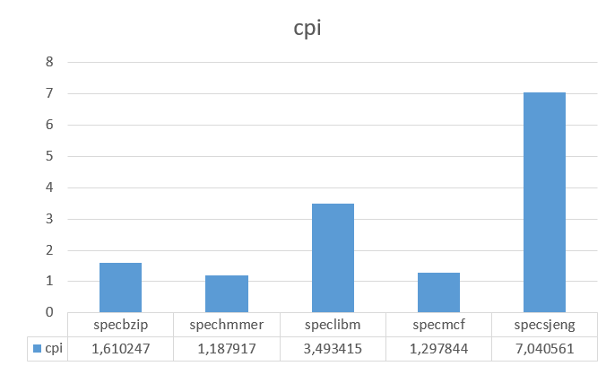
  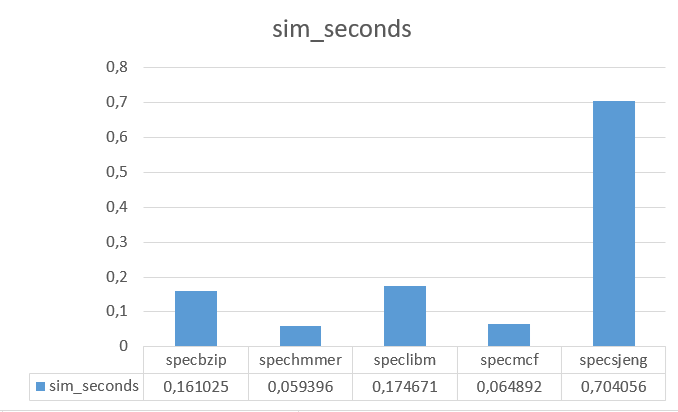
  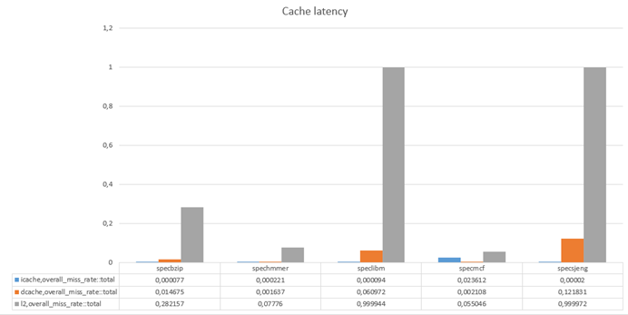

Με βάση τις πληροφορίες από το stats.txt βλέπουμε τις αποδόσεις του συστήματος για διάφορα benchmarks. Βλέποντας το CPI μπορούμε να καταλάβουμε την απόδοση του συστήματος. Εφόσον το ιδανικό CPI είναι 1 για το σύστημα παρατηρούμε ότι υπάρχει χώρος για βελτίωση ειδικά στα benchmarks speclibm και specsjeng. Αυτό επιβεβαιώνεται περαιτέρω βλέποντας τα miss rates τον cache και συγκεκριμένα του l2 που φτάνει κοντά στο 100% δηλαδή πρακτικά καθυστερεί το σύστημα αφού κάνει πάντα miss και πρέπει να την ελέγχουμε.

5. Αλλαγή GHz CPU
    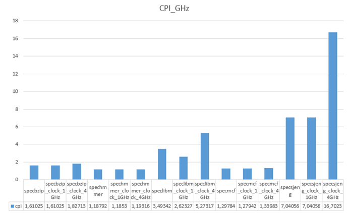
    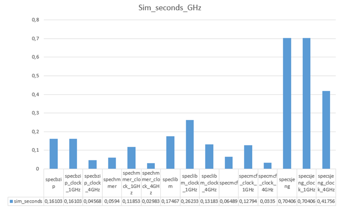

Αρχικά η default τιμές του system clock είναι 1GHz ενώ του επεξεργαστή 2GHz. Αλλάζοντας τα GHz του επεξεργαστή επιταχύνουμε μόνο την λειτουργία του δηλαδή πράγματα όπως το pipeline και όσες συσκευές έχουν system.cpu_clk_domain, δεν αλλάζουμε όμως την συχνότητα του συστήματος συνολικά. Το σύστημα αποτελείτε και από άλλες συσκευές με δικά τους clocks όπως η μνήμες cache και ram. Ρίχνοντας μια ματιά στο config.json μπορούμε να δούμε ότι με system.clk_domain χρονίζεται το membus που ενώνει την DRAM με την L2, η ίδια η DRAM και το system port. Με system.cpu_clk_domain δουλεύουν τα υπόλοιπα όπως οι cache και τα buses που τις ενώνουν. Αν προσθέσουμε και άλλο επεξεργαστή θα πάρει την τιμή system.cpu_clk_domain εφόσον βρίσκεται στο ίδιο cluster με τον αρχικό επεξεργαστή. Διαφορετικά μάλλον θα πάρει την default τιμή. Δεν υπάρχει τέλειο scaling καθώς υπάρχουν καθυστερήσεις στις cache αφού το miss rate στην l2 παραμένει μεγάλο. Επίσης η μνήμη DRAM καθυστερεί το σύστημα αφού είναι χρονισμένη διαφορετικά. Το φαινόμενο είναι πιο έντονο σε benchmarks που χρησιμοποιούν πιο πολύ την μνήμη αφού βλέπουμε ότι αυξάνεται και το CPI. Στα testbench όπως το spechmmer που η μνήμη δεν είναι τόσο σημαντική έχουμε πράγματι σχεδόν τέλειο scaling.

8. Αλλαγή μόνο DDR3_1600_x64 σε DDR3_2133_x64
   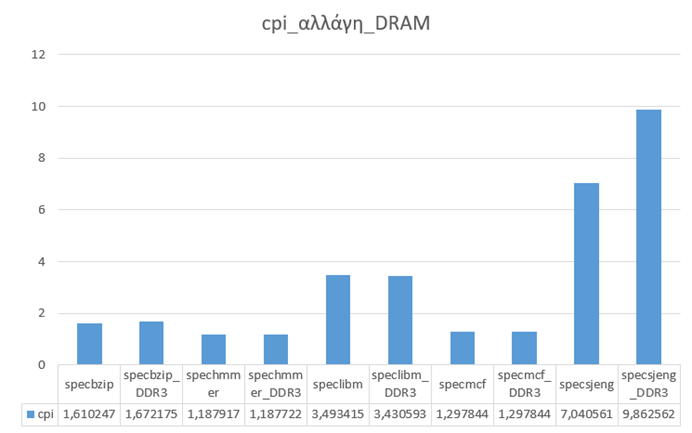
   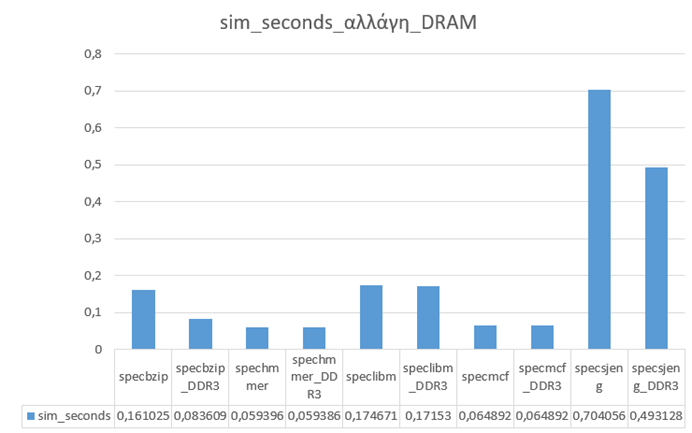

Εφόσον βάλαμε πιο γρήγορη DRAM τα benchmarks που απαιτούν πολλές προσβάσεις στην μνήμη έχουν μειωμένο CPI και τρέχουν πιο γρήγορα.

---

## Βήμα 2ο

### 1.
Το κύριο πρόβλημα με τις μνήμες cache είναι τα miss rate τους (ειδικά η L2). Με τα επόμενα 10 πειράματα προσπαθώ να αλλάξω τις μνήμες ώστε να μειώσω το miss rate. Οι συνδυασμοί που απορρίπτω είναι μικρότερα μεγέθη από ότι έχω τώρα και μικρότερο associativity. Επίσης το μικρότερο cacheline (το δοκίμασα μια φορά από περιέργεια). Οι παραπάνω συνδυασμοί χειροτερεύουν το miss rate.

**Σημείωση:** σε κάποια test έχω βάλει μικρότερη L2 από την αρχική. Αυτό έρχεται σε αντιπαράθεση με τους συνδυασμούς που απορρίπτω απλά δεν έχω χρόνο να τα ξανατρέξω.

### 2.
Τα τεστ είναι:

<!-- Εδώ μπαίνουν οι εικόνες των tests -->

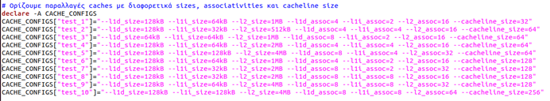

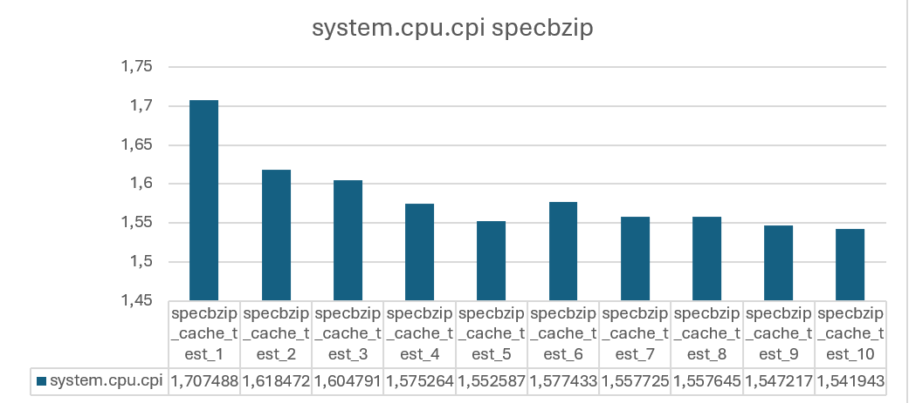

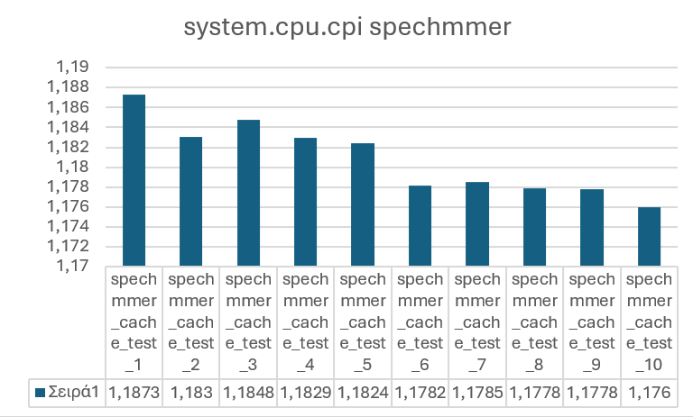

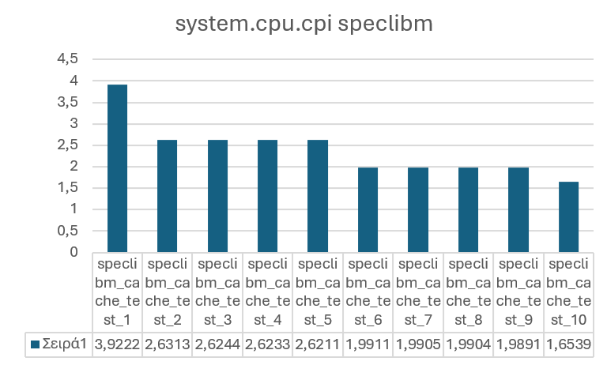

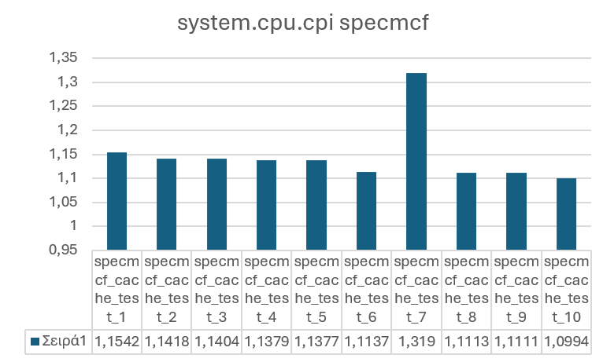

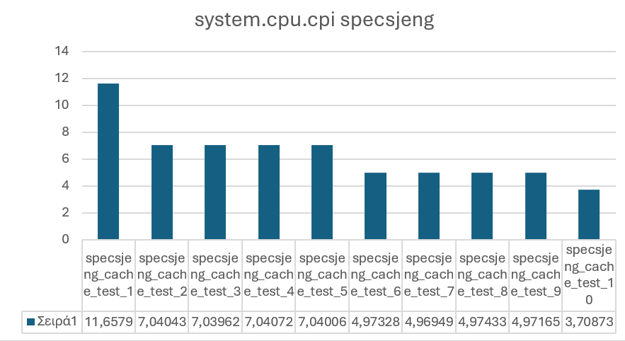

Γενικά παρατηρούμε ότι το κάθε benchmark έχει τις ιδιαιτερότητες του. Το μέγεθος του cacheline φαίνεται να είναι ο πιο καθοριστικός παράγοντας στην μείωση του CPI. Μετά από αυτό είναι η αύξηση των associativity τον cache και μετά οι αλλαγές στα μεγέθη. Ιδιαίτερο ενδιαφέρον προκαλεί το test 7 στον specmcf, όπου η μείωση του μεγέθους και του associativity της icache σε σχέση με τα άλλα test (είναι η default τιμές) επηρεάζει την απόδοση, ενώ στα άλλα test δεν βλέπουμε ιδιαίτερη διαφορά. Γενικά τα αποτελέσματα συμφωνούν με την θεωρία αφού σε κάθε τεστ βελτιώνουμε συνολικά τις δυνατότητες των cache όσο γίνεται και παρατηρούμε ότι το CPI μειώνεται από το test 1 στο test 10.

---

## Βήμα 3ο – Συνάρτηση Κόστους

Από τις βασικές αρχές της σχεδίασης ψηφιακών κυκλωμάτων γνωρίζουμε ότι το κόστος υλοποίησης μιας μνήμης αυξάνεται με το μέγεθός της, καθώς απαιτούνται περισσότερα αποθηκευτικά στοιχεία και μεγαλύτερο εμβαδό κυκλώματος. Παράλληλα, όσο αυξάνεται το μέγεθος της μνήμης αυξάνεται και το latency πρόσβασης, γεγονός που αποτελεί έναν από τους βασικούς λόγους ύπαρξης της ιεραρχίας μνημών και των cache. Στο Βήμα 2 μεταβλήθηκαν το μέγεθος των cache, το associativity, το cache line size και το επίπεδο της cache (L1 ή L2), παράγοντες που επηρεάζουν τόσο την πολυπλοκότητα όσο και την ταχύτητα του συστήματος.

Το μέγεθος της cache επηρεάζει γραμμικά το κόστος υλοποίησης, καθώς η αύξησή του οδηγεί σε αναλογική αύξηση του αριθμού των SRAM cells. Το associativity, από την άλλη πλευρά, δεν επηρεάζει το κόστος με τον ίδιο τρόπο, αφού η αύξησή του συνεπάγεται περισσότερους συγκριτές tag και πιο σύνθετη λογική επιλογής δεδομένων, αυξάνοντας την πολυπλοκότητα του κυκλώματος και το κρίσιμο μονοπάτι. Για τον λόγο αυτό το associativity επηρεάζει το latency πιο ήπια και μπορεί να προσεγγιστεί λογαριθμικά. Το cache line size δεν επηρεάζει άμεσα το hit latency της cache, αλλά επηρεάζει το miss penalty, καθώς σε περίπτωση αστοχίας πρέπει να μεταφερθεί ολόκληρο το cache line από το επόμενο επίπεδο μνήμης, αυξάνοντας τον χρόνο πρόσβασης και το traffic στο memory bus. Επιπλέον, η L1 cache θεωρείται σημαντικά ακριβότερη σε σχέση με την L2, καθώς απαιτεί πολύ χαμηλό latency και βρίσκεται στο κρίσιμο μονοπάτι του επεξεργαστή.

Με βάση τα παραπάνω, μια ενδεικτική συνάρτηση κόστους που αποτυπώνει ποιοτικά τα παραπάνω trade-offs μπορεί να γραφτεί ως:

Total_Cost =
  w1 · [ L1 · (α·S_L1 + β·A_L1) + L2 · (α·S_L2 + β·A_L2) ]
+ w2 · [ (δ·S_L1 + ε·log₂(A_L1)) + (δ·S_L2 + ε·log₂(A_L2)) ]
+ w3 · [ θ·CL_L1 · Miss_Rate_L1 + θ·CL_L2 · Miss_Rate_L2 ]

όπου S το μέγεθος της cache, A το associativity, CL το cache line size και L ένας συντελεστής που λαμβάνει μεγαλύτερη τιμή για την L1 σε σχέση με την L2. Η συνάρτηση αυτή δεν στοχεύει σε ακριβή ποσοτική αποτίμηση του κόστους, αλλά στην ποιοτική κατανόηση των σχεδιαστικών επιλογών και των επιπτώσεών τους στην απόδοση και την πολυπλοκότητα, όπως ακριβώς γίνεται και στον σχεδιασμό σύγχρονων επεξεργαστών.

